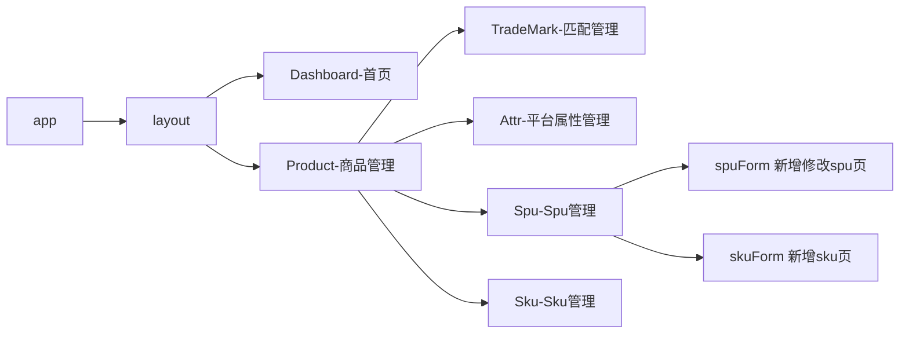

# 后台管理项目

### 1.登录业务

1.1 静态组件完成 

​	将英文的地方换成中文，添加背景图片等

1.2 书写API（换成真实的接口）

​	在@/api/user.js 文件，将登录、获取用户信息（token）、退出的 api请求换成真实的接口地址。

​	接口地址在swagger在线文档里

​	http://39.98.123.211:8170/swagger-ui.html
​	http://39.98.123.211:8216/swagger-ui.html	

1.3  仓库中派发action名为user/login，发请求

​		仓库中actions写的都是.then 方式处理异步，换成async 和await的。

1.3 axios二次封装

​	在@/utils/request.js 文件，将*X-Token* 换成token

1.4 换成真实接口之后需要解决代理跨域问题(解决代理跨域问题)

​	在vue.config.js文件里配置

1.6 换标题以及图标

在src下settings文件下 设置标题（里边还可以设置导航条的固定，和左边标题显示否），在public下index.html里设置图标。

### 2.退出登录

在@/layout/components/Navbar.vue 里有整个顶部导航条，包含退出功能。

### 3.路由分析

1.将没用的路由删掉（from、nested等）

2.重新写路由器，注册路由。

需要<strong style='color:red'>注意</strong> meta属性里放的是 title侧边栏和面包屑中展示的名称，还有对应的icon图标



### 4.TradeMark组件（品牌管理）

1.完成静态组件

用了ElementUI的 el-button 和 el-table 表格 el-table-column 列 和 el-pagination 分页器

2.写api

在api文件下，创建目录product，将商品管理的四个部分分别创建js文件，文件里统一暴露发送请求的方法

在api文件下，创建文件index.js引入刚刚统一暴露的四个，然后默认暴露。

到main下，引入这个index，将api添加到Vue 的原型上

> 为什么要这样做？
>
> 因为：我们不在仓库 里发请求，在组件里发请求，为了不在组件里一个一个引入api麻烦，所以把所有api统一放到Vue原型上，组件实例的原型的原型指向的是Vue的prototype（类似与$bus）

```js
import API from '@/api'
Vue.prototype.$API = API
```

3.组件中发请求，收集数据（挂载）

因为请求不止在组件挂载会发，点分页器也会在发，所以直接在methods里封装一个函数发请求。

函数里首先发请求要带俩个参数（当前在第几页，一页展示数据条数），所以要在data里给设置初始值，当请求成功以后，服务器返回的（*总页数*，及*商品数据数组*）要存到data里在。

4.页面标签拿数据动态展示

在UI组件库的el-table标签中 data属性指定要展示的数据（数组）= 组件data里 的list

el-table-column标签中，prop指定对应列内容的字段名 = list数组里的key

> 1 序号列 
>
> 服务器没有返回这个数据，所以使用el-table-column的type属性，type='index' :index='' 可以设置自定义索引 （由于换页后，索引不连续），并且序号列需要居中 align="center"
>
> 2 匹配名称列
>
> 用el-table-column的prop属性，prop="tmName"
>
> 3 匹配logo列
>
> 服务器返回的是url，prop="logoUrl"，是一个链接地址，所以要用到作用域插槽。
>
> 插入一个img标签，利用src属性读取图片。
>
> ```js
> <template slot-scope="{ row }"> //父组件接收子组件传的数据
>   
> </template>
> ```
>
> 4 操作列
>
> 服务器没有返回数据，同样用作用域插槽，插入俩个el-button

关于这里最后俩列使用作用域插槽，我的理解：

首先是为什么使用插槽，因为el-table-column的prop属性没办法从服务器返回的数据里直接获取到数据进行展示，（像图片。需要放到一个src结构，像按钮，本身并不能用prop展示）

其次，使用作用域插槽的原理，el-table-column是一个子组件，它底层封装里一个插槽，并且还把el-table，data属性传给它的值，在传到使用插槽的使用者这。也就是当前的父组件tradeMark，然后由父组件决定它的样式，并拿到了它传来的值，解构。

实际上，有点浪费手续，因为这里的数据本身就在父组件身上，完全可以不用插槽，。

5.设置分页器，动态展示页数、总页数等，并设置点击换页等事件发请求。

### 5.TradeMark组件增删改-增改

添加和删除用的同一个UI组件，名为Dialog 对话框

1.将Dialog 组件几个静态复制到项目中，

```vue
<el-dialog>
	//先来一个表单
	<el-form>
		//第一个里放input文本框
		<el-form-item><el-input></el-form-item>
		//第二个里放导入图片的小组件upload
		<el-form-item><el-upload></el-form-item>
	</el-form>
	//再来一个div里放俩按钮
	<div>
	<el-button></el-button>
	<el-button></el-button>
	</div>
</el-dialog>
```

2.给添加和修改按钮绑定点击事件，回调为将上面的对话框显示，`this.dialogFormVisible=true`

3.写添加品牌和修改的API

新增带俩个参数，（名称和图片），修改带三个参数（多id）封装到一个函数里，进行判断。

4.在组件中发请求，（收集数据做为参数）

​	1.对于el-form 收集数据 需要给添加一个model属性，`:model="tmForm"`收集的数据都放到tmForm对象里，对象里存的是`tmName:'' ,logoUrl:''`	

​	2.给el-input绑定`v-mode="tmForm.tmName"`

​	3.上传的图片不是表单元素，不能用v-model收集数据的，用的是<el-upload>里的上传成功事件，事件回调参数会返回图片的url，我们把这个url收集到`tmForm.logoUrl`

> 到这里服务器需要的参数我们都拿到了，点对话框的确定会发请求，但有个细节需要注意，如果点取消，在再次打开对话框需要清除data里存的数据才行。所以给添加事件在增加一个
>
> `this.tmForm={tmName:'',logoUrl:''}`

​	4.给对话框确定按钮绑定自定义事件

​	发请求将tmForm带给服务器，如果请求成功弹窗添加成功或修改成功，再次获取服务器数据展示

​	5.对话框取消按钮默认的事件写的是关闭对话框

> 修改，按钮事件回调，将点击事件传来的参数（row：点的那个品牌的所有信息包括id名字图片）赋值给 data里存的要给服务器带的参数tmForm里。<strong style='color:red'>注意</strong>这里如果直接赋值的话，会双向绑定，所以采用浅拷贝
>
> `this.tmForm = { ...row };`
>
> 为什么用浅拷贝？我的理解
>
> 因为  el-table 的最后一列操作列，el-table-column组件，它用的作用域插槽，父组件el-table把list传给它，它身上有list，它又把这个list在插槽里传给使用者，然后在trademark组件里，使用它时（决定它的样式结构），要接收传来的参数list，用的是解构赋值{row}。
>
> 所以如果直接给tmForm 赋值row，tmForm 和row指向的同一个内存地址，那么tmForm v-model收集到的数据，同样会改变row，row是来自于list，相当于页面上用list渲染 的数据也会变化。

5.表单验证

1.给from表单添加属性`:rules="rules"`（同时必须要有model属性才行收集表单数据）

2.在data里写一个新配置项rules

3.设置 *Form-Item 的 prop 属性设置为需校验的字段名*

4.在最后点击对话框确定时（提交数据给服务器）回调函数里进行判断所有验证是否通过，提前要给from打一个ref标识，回调里拿到from标签结构，利用一个方法validate实现。

`this.$refs.ruleForm.validate((success)=>{if(success){}else{}})`

5.自定义经验规则


```js
1.在data里rules书写表单验证规则时，自定义规则
{ validator: validateTmName, trigger: "change" }，
2.validateTmName是一个函数，在data里定义它
  data() {
    //自定义校验规则
    var validateTmName = (rule, value, callback) => {
      //自定义校验规则
      if (value.length < 2 || value.length > 10) {
        callback(new Error("品牌名称2-10位"));
      } else {
        callback();
      }
    };
    return{......}
 }
```


### 6.TradeMark组件增删改-删

1.写api

2.点击删除按钮绑定单击函数（需要传参row），函数回调里用到了一个小组件MessageBox弹框,

当弹框点击确定后，向服务器发请求，如果请求成功则再在获取数据进行展示，并提示删除成功！

### 7.Attr组件（平台属性管理）

7.1.完成静态组件

用了el-card（卡片）布局，

- 第一个card里放行内form，一行有多个表单元素。

  *里边放三级联动的form组件，因为这个三级联动很多组件复用，所以封装为一个全局组件。在mainjs里引入注册使用。

  ```vue
  //引入三级联动组件
  
  import CategorySelect from '@/components/CategorySelect'
  
  Vue.component(CategorySelect.name,CategorySelect)
  ```

  *然后在封装的CategorySelect组件完成静态页面，使用el-form行内表单组件。

  

- 第二个card里放 el-button和el-table。

7.2.写api发请求

获取一二三级分类数据,和获取商品属性

7.3.CategorySelect子组件中

<strong>获取一级菜单内容展示</strong>

当组件Attr挂载时，获取到一级菜单的数据，放到data里（数组），然后动态渲染到页面，利用v-for展示下拉框里的`el-option`。而当我们选择了内容以后，select框里应该展示对应的内容，并且还要收集它的id，

```vue
<el-form :inline="true" class="demo-form-inline" :model='cForm'> 
    //form里:model将表单收集到的数据放到cForm里
  <el-form-item label="一级分类">
    <el-select v-model="cForm.category1Id" placeholder="请选择">
        //下拉选择框v-model双向绑定cForm.category1Id，
      <el-option 
      :label="c1.name" 
      :value="c1.id" 
      v-for="c1 in list1" 
      :key="c1.id"
      >
       //选择具体内容:value收集到选的对应的id
      </el-option>
    </el-select>
  </el-form-item>
</el-form>    
--------------------------------------------------------------- 
data() {
      return {
		//一级分类的数据
          list1:[],
		//收集相应的一级二级三级分类的id
      cForm: {
        category1Id: "",
        category2Id: "",
        category3Id: "",
      },
      }
  },
```

<strong>获取二级菜单内容展示</strong>

当一级分类的option的数据发送变化的时候，发请求获取二级菜单数据，并且要把对应的一级分类id带上参数

给一级分类el-select绑定change事件，事件回调，将一级id拿到调用二级api请求，请求成功将服务器返回的二级数据存到data的list2里。然后同上渲染到页面，并收集二级id。


```js
    async handler1(){
        //清除数据  ---再次选择时要清掉2.3级分类的内容
      this.list2 = [];
      this.list3 = [];
      this.cForm.category2Id = "";
      this.cForm.category3Id = "";
        const { category1Id } = this.cForm
        //获取二级分类的请求：需要带一级id
        let result = await this.$API.attr.reqCategory2List(category1Id);
         if (result.code == 200) {
            this.list2 = result.data;
        }
    }
```


<strong>获取三级菜单内容展示</strong>

同上

<strong style="color:red">注意</strong>: 

1.一二级菜单重新选择后要请掉下一级菜单的数据

2.每一级菜单在change变化时，要给父组件Attr传它的id，涉及到子父组件通信（用自定义事件getCategoryId）

3.父组件拿到id后，进行判断，一级菜单传的放到一级对应的data里。。。当三级id传来时，同时也发请求获取商品基础属性。存到data里。

> 为什么必须要把数据传给父组件Attr发请求，而不是在三级联动里当第三级change时回调里发，拿到数据在传给父组件？
>
> 因为这个三级联动是一个全局组件，其他组件在使用它时是不需要发这个请求的。


7.4.回到Attr组件，根据data里的数据，动态渲染第二个card(el-table)

el-button 添加属性，当三级id存在才能点，`:disabled='!category3Id'`

el-table 里加边框border，取数据`:data="attrList"`

el-column

- 第一列序号：宽度为80，并且居中，没有值不用prop，用`type='index'`

- 第二列属性名称：宽度150，取值为`prop='attrName'` 是从attrList数组里来的

- 第三列属性值：宽度不指定width，取值用作用域插槽

  用到了一个小组件 标签el-tag展示属性值，并且v-for遍历数据。

  ```vue
   <template slot-scope="{row}">
     <el-tag 
     type="success" 
     v-for="attrValue in row.attrValueList" 
     :key="attrValue.id" 
     style="margin:10px 20px"
     >
     {{attrValue.valueName}}
     </el-tag>
   </template>
  ```

  

- 第四列操作：宽度150，取值作用域插槽，放俩个el-button

### 8.Attr组件增删改-增改

8.1完成添加属性和修改属性点击事件。当点击添加属性或修改属性时，要影藏第二个card里的div（属性列表；弄个div包起来`v-show="isShowTable"`），换成另一个div（添加修改属性）

8.2完成另一个div（添加修改属性） 的静态页面（`v-show="!isShowTable"`）

**8.3收集数据**

8.3.1完成收集属性名（el-form里的el-input）

利用form表单元素model属性将输入数据放到。`v-model='attrInfo.attrName'`

8.3.2收集属性值（el-table）

利用table的data属性指定将输入数据放到。`valueName`

```js
attrInfo: {
  attrName: "string",//属性名
  attrValueList: [ //属性值，值有很多用数组存
    {
      attrId: 0, //属性名id
      valueName: "string", //属性值名
    },
  ],
  categoryId: 0, //三级分类id,这个三级分类id不能用this.category3Id收集，因为对象里的数据是无序存储的，谁在前不一定，如果这个AttrInfo存在三级分类id前，它是读取不到的。
  categoryLevel: 3,
},
```

8.4优化功能。

1.当属性名没有时，添加属性按钮不能动

- [ ] 给添加属性按钮设置disabled属性，条件是当data里有属性名
- [x] `:disabled="!attrInfo.attrName"`

2.当上来没添加属性值时，没有对应的属性值输入框

- [ ] 在data里开始那个数组attrValueList置为空，当点击添加属性按钮后将一个对象加入数组，设置回调函数

- [x] ```js
  addAtrrValue(){
        this.attrInfo.attrValueList.push({
          attrid:undefined, // 新增属性没有属性id
          valueName:''})
      }
  ```

3.当点击**取消**按钮回到属性列表展示div页时，再在点击**添加属性**进入添加修改属性div，不能在有任何数据（上一次的数据）

- [ ] 给**添加属性**按钮绑定单击函数，

- [x] ```js
      addAttr(){
        //影藏属性列表div
        this.isShowTable = false
        //清楚数据并收集三级id
        this.attrInfo ={
          attrName: "",
          attrValueList: [],
          categoryId: this.category3Id, //此时收集三级id
          categoryLevel: 3,
        }
      }
  ```


4.当显示添加修改属性div时，三级联动选择框不能动

当Attr组件的isShowTable为false时下拉框不能动，所以要把这个isShowTable从父组件prop传递到子组件CategorySelect三级联动`:show="!isShowTable"`，并且给每一个el-select加一个属性 `:disabled = 'show'`

5.当没有属性值时，保存按钮不能动

加一个`:disabled ="attrInfo.attrValueList.length <1"`

8.5修改属性操作

给修改属性绑定单击函数，<strong style='color:red'>注意</strong>深拷贝，要使用lodash里封装的一个函数cloneDeep，按需引入

```
    updateAttr(row){
      //隐藏属性列表div
      this.isShowTable = false
      //将选中的属性row赋值给AttrInfo展示页面，但是要进行深拷贝
      this.attrInfo=cloneDeep(row)
    }
```

8.6查看模式与编辑模式切换

input和span用v-if控制展示切换，条件是 一个信号量flag。但是要给每一个属性值都加一个自己独有的信号量，在添加属性值回调中，多加一个`flag:true`

<strong style='color:red'>注意</strong>

​	1.如果属性值为空，不能成功作为新的属性值

```js
 if(row.valueName.trim() ==''){

  this.$message('属性值输入非法！请重新输入')

   return

 }
```

​	2.如果新增的属性值与已有的属性值重复，不能作为新的属性值

```js
      //如果新增的属性值与已有的属性值重复，不能作为新的属性值
      let isRepat = this.attrInfo.attrValueList.some(item =>{
        if(row!==item){ 
          //row：最新添加的属性值，attrValueList数组的最后一项
          //item：attrValueList数组所有属性值项
          //row!==item把它自身过滤掉，然后与其他项对比，相等返回true
          return row.valueName == item.valueName
        }
      })
      if(!isRepat){
        this.$message('属性值重复，请重新输入！')
        return
      }
```

​	

8.7.input自动聚焦

点span获取到input让他聚焦，给input打一个`ref=$index`($index代表的是每一个input的索引由作用域插槽传递的)，给span绑定单击事件，回调如果直接 `this.$refs[index]`是获取不到input节点的（因为一个节点渲染的问题） 所以需要用到$nextTick生命周期函数，当节点渲染完毕执行一次。

```js
this.$nextTick(()=>{
  //获取input，聚焦
  this.$refs[index].focus()
})
```

当点击添加属性值时让input聚焦，绑定事件

```js
  this.$nextTick(()=>{
  //获取input，聚焦
  this.$refs[this.attrInfo.attrValueList.length-1].focus()
})
```


### 9.Attr组件增删改-删

1.属性值删除

用el-ui的气泡确认框组件`el-popconfirm`，当点击气泡框确认按钮后触发回调，把索引值传递，将data里存的`this.attrInfo.attrValueList`数组，的该索引值的记录删掉（不需要发请求。）

```js
deleteAttrValue(index){
  this.attrInfo.attrValueList.splice(index,1)
}
```

2.点击保存，要发请求,将之前收集好的数据做为参数传给服务器并回到另一个div（属性列表)

​	1.写api

​	2.给保存绑定点击函数，发请求，成功将`isShowTable=true`

​	回调函数里整理参数要考虑： 用户添加的空属性值，不能带给服务器；属性值数据数组里的flag字段不能送给服务器要清掉


3.不知道为什么，没做属性的删除！！！

### 10.spu组件（类）

10.1完成静态页面

10.2写api

10.3spu组件当三级联动第三级数据选中，（此时将三级id通过自定义事件传给spu组件时）发请求

10.4动态渲染table，展示spu数据，完成分页器及分页器的俩个回调。


### 11.spu组件card内容切换

**三种页面用scene信号量（0：展示SPU列表，1：添加spu或修改spu，2：展示添加SKU结构）`v-show="scene==0"`控制切换**

#### [展示SPU列表]()

初始状态展示SPU列表，

#### [展示添加spu或修改spu](spuForm组件)

由于这个页面结构复杂点所以不在SPU组件里用div控制显示隐藏了，直接弄成一个组件spuForm。

- 给添加和修改按钮绑定单击事件把信号量 **`scene`** 置为1

- 完成静态页面（表单form，由六个item组成）

- 写api，要发四个请求（获取点的spu信息，获取点的spu的图片，获取所有品牌，获取所有销售属性）

- 业务分析。分析什么时候发请求

  > 因为是v-show，所以子组件在spu父组件挂载以后不会卸载，所以不能在子组件mount的时候发请求获取spu信息。所以考虑在父组件点击修改按钮进入子组件时发请求，在子组件里写好发请求的方法`initSpuData`，但是要获取到子组件，所以在父组件里给子组件标签打`ref="spu"`，给按钮绑定事件`updateSpu`，通过ref获取到子组件，进而拿到子组件身上发请求的方法并且把点的那个spu传入参数`this.$refs.spu.initSpuData(row)`

-  数据动态展示，及收集

- 给添加销售属性绑定点击事件，给table绑定的data数组`spu.spuSaleAttrList`里push新添加的销售属性

- 销售属性属性值添加，及数据收集<strong style='color:red'>注意</strong>这里的数据存在对象里，往对象里添加属性不是响应式 的所以要利用一个方法$set。`this.$set(row,'inputVisible',true)`

- 销售属性值的删除，与销售属性的删除完成

- 修改spu保存按钮实现

  - 当点击保存后，要整理参数
  - 写api发请求
  
- 删除spu操作，发请求

#### [展示添加SKU结构](skuForm组件)

由于这个页面结构复杂点所以不在SPU组件里用div控制显示隐藏了，直接弄成一个组件skuForm。

- ​	给添加sku按钮绑定单击事件将scene置为2
- 写skuform静态页面（表单from，由9个item组成）
- 父组件spu里点击添加sku后通过ref调用子组件skuForm封装好的方法发送请求（三个请求）写好api。
- skuForm组件数据动态展示与收集。
- 保存与取消按钮完成，发请求

#### [展示查看SKU列表]()


第三个button按钮点击后查看当前spu添加的所有sku信息。

展示需要用对话框插件 Dialog  ，中 `:visible.sync="dialogTableVisible"` 。控制显示影藏，当点击button时显示，默认为false，并且发请求获取当前点击的spu的sku信息。

<strong style="color:red">注意：</strong>在展示数据时加一个loading效果，而这个loading效果通过data里loading数据控制，所以在点击按钮button时发请求收到服务器返回后置为false，默认为true。但是要在对话框关闭时将loading重新置为true，并且清空服务器返回的数据。


### 12.sku组件

1.写api获取sku列表

2.完成静态页面，（table7个el-table-column和分页器）在组件挂载时和点击分页器发请求。

3.获取服务器数据动态展示到页面并完成分页器。

4.上架，下架操作

​	俩个按钮通过v-if判断服务器返回的isSale字段，为0为下架。

​	给按钮绑定单击响应函数，点击后发请求（写api）

5.修改 没做弹出正在开发中！！！

6.查看sku详情

- ​	写api
- 绑定button点击事件发请求获取数据保存到data里，通过elmentui组件提供的抽屉Drawer组件展示数据
- 在抽屉里通过Layout实现布局（需要写点样式调整）

<strong style="color:red">注意：</strong>轮播图里修改 切换图案，时加style样式，需要用到深度选择器

```
style中scoped理解： 

1.之前的理解加上scoped的作用是只对于当前组件有用的样式
对于某一个组件如果在style中加上scoped属性，那么会给当前组件及子组件的结构中都加上一个data-v-xxxx自定义属性，vue通过属性选择器h3[data-v-xxxx]加上样式
2.所以如果子组件的跟标签跟父组件的选择器样式相同（拥有相同的自定义属性），则也会有相应的样式
3.如果父组件加了scoped还想影响子组件的样式，我们可以使用深度选择器。
原生css  >>>
less   /deep/
scss  ::v-deep
```

### 13.home首页


> 分析：首先将home首页模块，分为3个子组件，Card（头部的四个card标签）、Sale、Observe

**1.**card组件

- [ ] 利用el-row栅格布局，el-col 分为4个，分别放一个el-card

- [ ] el-card里写布局，布局分为子组件Detail完成（每一个el-card里写一个Detail组件，共用子组件）

  1.2 Detail组件

  > 分成四个div（头部，内容，图表，底部）
  >
  > **头部，内容**  数据直接写在div标签体里
  >
  > **图表**   写插槽，通过父组件Card传入结构。其中图表也封装为组件
  >
  > **底部**  写插槽，通过父组件Card传入结构

  1.3 折线图 lineChart组件
  
  vue里使用echarts制作折线图，先安装echarts插件，需要在组件mounted通过ref获取dom，必须要指定div容器的大小
  
  1.4柱状图 barChart组件
  
  类似同上
  
  1.5进度条progressChart组件
  
  通过柱状图完成，只写一个点通过均分x轴横过来，通过 *文本标签*设置进度条的竖线
  

**2.**sale组件

- [ ] ​	利用el-card布局，头部使用el-tags标签页组件，下面使用el-row栅格 左右布局，左边放柱状图，右边弄无序列表设置排序。

- [ ] 完成页面静态后，完成功能：

  1.echarts标题文字与左侧排序h3标题随tags标签页动态切换。通过计算属性将data里activeName判断返回，通过监视属性，监听activeName变化，将myCharts（echarts实例）的setOption配置项的title属性重新赋值替换。

  2.收集时间选择器选择的时间，双向绑定，再设置本周年月日span的点击函数，将对应的时间置为data里，实现切换时间。（处理时间可以使用`dayjs`插件）

**3.**Observe组件

- [ ] ​	利用el-row布局左侧为组件search右侧为组件category
- [ ] 完成左侧search组件静态，头部左侧是span，右侧三个点通过Dropdown 下拉菜单组件实现。下方是一个柱状图组件，在下方是el-table（带排序），最后是分页器。
- [ ] 完成右侧category组件静态，头部左侧是span右侧是Radio 单选框，底部是一个echarts饼图


**4.**mock数据展示--未完成

### 14.权限管理

1.将写好的组件复制好，

2.将api文件复制好，在api下的index里合并权限相关的api。

3.将写好的权限路由复制到route下index里。

**4**.在用户登录时，根据token获取用户信息，服务器会返回当前用户应该有哪些权限，因此在发请求的仓库中user将数据存储到仓库里。

**5.**需要把项目中的路由拆分，

- [ ] ​	常量路由：

  登录，首页，404，

- [ ] ​    异步路由：

  商品管理、权限管理、测试管理

- [ ] 任意路由

  当路径出现错误时重定向当404

**6.** 对比服务器返回的当前用户的异步路由  与   路由里写好的全部异步路由

​	1.在userjs仓库中，当根据token获取用户信息成功后，提交到commit，commit里